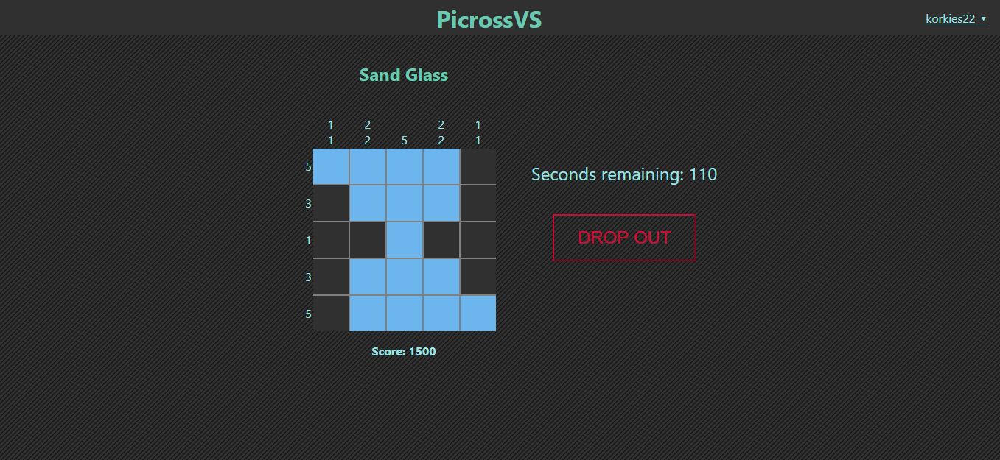

# PicrossVS

Competitive multiplayer version of the fun mind-daunting game Picross. Challenge your friends by selecting your board of preference in an exciting real time web experience

## Colaborators

- Carlos Mario Sarmiento: Alias "El Korkies"

  [Personal Site](https://korkies22.github.io/Portfolio/) - [GitHub](https://github.com/korkies22/)

- Sergio Guzmán Mayorga: Alias "El Checho"

  [Personal Site](https://sguzmanm.github.io/i-am-sergio-guzman/) - [GitHub](https://github.com/sguzmanm)

## Links

**Deployed at: https://picross-vs.herokuapp.com/**

## Description

PicrossVS allows people to challenge random players in a competitive battle to solve a Picross Board. Boards can be selected in sizes of 5x5,10x10,and 20x20 tiles per board. Also, people can choose to create a game for 1 up to 4 people at the same time. Each player gains points while they complete the board. But be careful, one mistake and you will lose points. There is an extra bonus score according to the order of completion of the game. If someone leaves a match, they will be penalized with a lot of points!

## Objective

We want to allow people to play picross (commonly known as nonograms) with their friends for the sake of spending their free time and having fun

## Tecnologies used

This project was developed using:

- **Meteor**: A web app framework for JS for real-time databases and interactions between clients. https://www.meteor.com/
- **Mongo DB**: MongoDB was used as a NOSQL database. Here users,boards and games are stored. This implementation of Mongo DB is specific for Meteor (Meteor Mongo). https://docs.meteor.com/api/collections.html
- **React JS**: A Front End library useful for creating components. https://reactjs.org/
- **Node JS**: A javascript environment which allows to create a web server with javascript. https://nodejs.org

## Instructions to execute

### Requisites

- Install nodejs **https://nodejs.org/**
- Install meteor **https://www.meteor.com/install**
- Install Heroku CLI(Optional, for replicating our deployment only) **https://devcenter.heroku.com/articles/heroku-cli**

### Setup

Clone this project

```
git clone https://github.com/sguzmanm/PicrossVS/
```

Install dependencies

```
cd PicrossVS
```

Verify that nodejs is installed by running "node -v" on terminal or cmd. It can be downloaded in https://nodejs.org/ (versión LTS)

```
meteor npm install
```

Create a .env file in the main folder with the variable MONGO_URL, which represents the connection url of your mongo database.

Run project

```
npm run dev
```

### Steps to deploy production version into Heroku

It is assumed that the Heroku CLI is setup in your computer for this and connected to a project. If you are not sure or do not have this, please visit https://devcenter.heroku.com/articles/getting-started-with-nodejs.

Setup env vars in heroku of the.env file, by [dashboard](https://dashboard.heroku.com/) or CLI with:

```
heroku config:set <KEY>=<value>
```

Set the environamental variable of ROOT_URL to the url where your heroku page will be deployed and MONGO_URL with the connection url to your MongoDB instance.

After all this, just deploy your project with:

```
git push heroku master
```

## Screenshots

### Match



## License

This project is public under the MIT license, found [here](https://github.com/sguzmanm/PicrossVS/blob/master/LICENSE)

## Extras

### Meteor NPM Libs

- dotenv: Env vars

### Meteor packages

- fourseven:scss
- accounts-ui
- accounts-password
- react-meteor-data

### Database models

```
Users:
{
    username,
    password,
    totalScore
}
```

```
Boards:{
    name: 'xxx',
    rows:[]=a-b-c,
    columns:[]=d-e-f,
    goal:[][]=0/1,
    '''curCells:[][]=0/1/2/-1(Undefined,correct,flagged,incorrect)''' (Only during a match)
}
```

```
Game: {
    state:0/1/2/3 (WaitingForPlayers,Active,Finished,Cancelled),
    players:[]={user,boards:Board, curScore,state},
    numWaitedUsers (Num of users the game should wait for),
    numFinished (Num of users that have finished the board),
    board: Base board for the game
}
```
